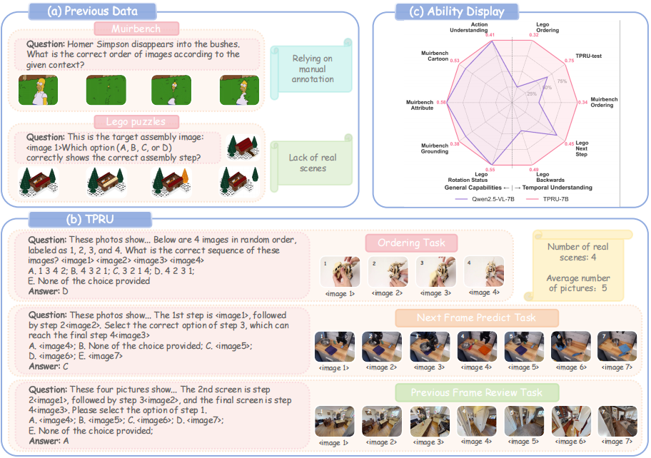

# TPRU: Advancing Temporal and Procedural Understanding in Large Multimodal Models (ICLR 2026)

The official repository for "TPRU: Advancing Temporal and Procedural Understanding in Large Multimodal Models".

<p align="center">

<p align="center">
🤗 <a href="https://huggingface.co/datasets/Stephengzk/TPRU-25k">TPRU 25k</a>&nbsp&nbsp | &nbsp&nbsp🤗 <a href="https://huggingface.co/datasets/Stephengzk/TPRU-test">TPRU-test</a>&nbsp&nbsp | &nbsp&nbsp📑 <a href="https://openreview.net/forum?id=crOvAD9MPA&referrer=%5BAuthor%20Console%5D(%2Fgroup%3Fid%3DICLR.cc%2F2026%2FConference%2FAuthors%23your-submissions)">Paper (ICLR 2026)</a>&nbsp&nbsp
</p>

<p align="center">
       🤗 <a href="https://huggingface.co/Stephengzk/TPRU-3B">TPRU-3B</a>&nbsp&nbsp | &nbsp&nbsp🤗 <a href="https://huggingface.co/Stephengzk/TPRU-7B">TPRU-7B<a>&nbsp&nbsp | &nbsp&nbsp🤗 <a href="https://huggingface.co/Stephengzk/TPRU-32B">TPRU-32B</a>&nbsp&nbsp |  &nbsp&nbsp📑 <a href="https://openreview.net/forum?id=crOvAD9MPA&referrer=%5BAuthor%20Console%5D(%2Fgroup%3Fid%3DICLR.cc%2F2026%2FConference%2FAuthors%23your-submissions)">Arxiv Paper</a>&nbsp&nbsp
</p>

## News

- [2026/02/12] **We released [TPRU-25k](https://huggingface.co/datasets/Stephengzk/TPRU-25k), [TPRU-test](https://huggingface.co/datasets/Stephengzk/TPRU-test), [TPRU-3B](https://huggingface.co/Stephengzk/TPRU-3B), [TPRU-7B](https://huggingface.co/Stephengzk/TPRU-7B), [TPRU-32B](https://huggingface.co/Stephengzk/TPRU-32B)** !
- [2026/01/26] **TPRU has been accepted by ICLR 2026!** 
- [2025/09/26] We introduce **TPRU**, a large-scale dataset designed to cultivate temporal reasoning in MLLMs via three complementary tasks: *Temporal Reordering*, *Next-Frame Prediction*, and *Previous-Frame Review*.


## Introduction

Multimodal Large Language Models (MLLMs), particularly smaller variants, often exhibit a critical deficiency in understanding temporal and procedural visual data. This gap hinders their application in real-world embodied AI tasks like robotic manipulation and navigation.

To address this, we introduce **TPRU** (**T**emporal-**Pr**ocedural and **U**nderstanding), a dataset and training paradigm designed to bridge this gap. TPRU sources 24,750 high-quality training samples from diverse embodied scenarios (Robotic Manipulation, LEGO Assembly, GUI Navigation, etc.). By leveraging reinforcement learning (GRPO) with our specific temporal tasks, our **TPRU-7B** model achieves state-of-the-art results, significantly performing larger proprietary models like **GPT-4o** on procedural understanding benchmarks.




Figure 1: Overview of the TPRU dataset and task formulation. Unlike prior datasets, TPRU enforces active cross-modal validation through negative samples and structured temporal tasks.


## TPRU dataset

The TPRU dataset is systematically designed to enhance procedural logic through three core tasks:

1. **Temporal Reordering:** Reconstructing the correct sequence of shuffled frames.


2. **Next-Frame Prediction:** Predicting the immediate future state given a sequence.


3. **Previous-Frame Review:** deducing the prerequisite state given an outcome.


## Performance

Our RL-finetuned **TPRU-7B** demonstrates massive improvements in temporal reasoning, outperforming significantly larger models.


### MuirBench Results


### Lego-puzzles Results


### Other Multi-image Benchmark Results


### TPRU-test Results


## Quick Start

```bash
git clone https://github.com/Stephen-gzk/TPRU.git

cd TPRU

conda create -n tpru python=3.10

conda activate tpru

pip install torch==2.6.0

pip install requirements.txt

wget https://github.com/Dao-AILab/flash-attention/releases/download/v2.7.4.post1/flash_attn-2.7.4.post1+cu12torch2.6cxx11abiFALSE-cp310-cp310-linux_x86_64.whl

pip install flash_attn-2.7.4.post1+cu12torch2.6cxx11abiFALSE-cp310-cp310-linux_x86_64.whl

```


## Training & Evaluation

We utilize the **Easy-R1** framework with Group-wise Preference Optimization (GRPO) for training.


### Training

To reproduce the TPRU-7B model using the TPRU-25K dataset:

```bash
# Example script for GRPO training
bash ./examples/tpru-7b.sh

```


### Evaluation

To evaluate on TPRU-Test and other benchmarks using VLMEvalKit:

```bash
(Comming Soon):We are in contact with the vlmevalkit team to integrate our TPRU-test into the vlmevalkit tool.
```


## Citation

If you find this repo or the TPRU dataset useful for your research, please consider citing our ICLR 2026 paper:

```bibtex
@inproceedings{gao2026tpru,
  title={TPRU: Advancing Temporal and Procedural Understanding in Large Multimodal Models},
  author={Gao, Zhenkun and Wang, Xuhong and Tan, Xin and Xie, Yuan},
  booktitle={Published as a conference paper at ICLR 2026},
  year={2026}
}

```


## Acknowledgements

We thank the developers of [Qwen2.5-VL](https://github.com/QwenLM/Qwen2.5-VL), [Easy-R1](https://github.com/hiyouga/EasyR1), and [VLMEvalKit](https://github.com/open-compass/VLMEvalKit) for their open-source contributions.